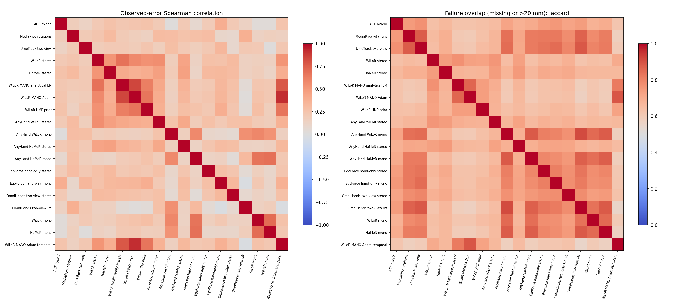
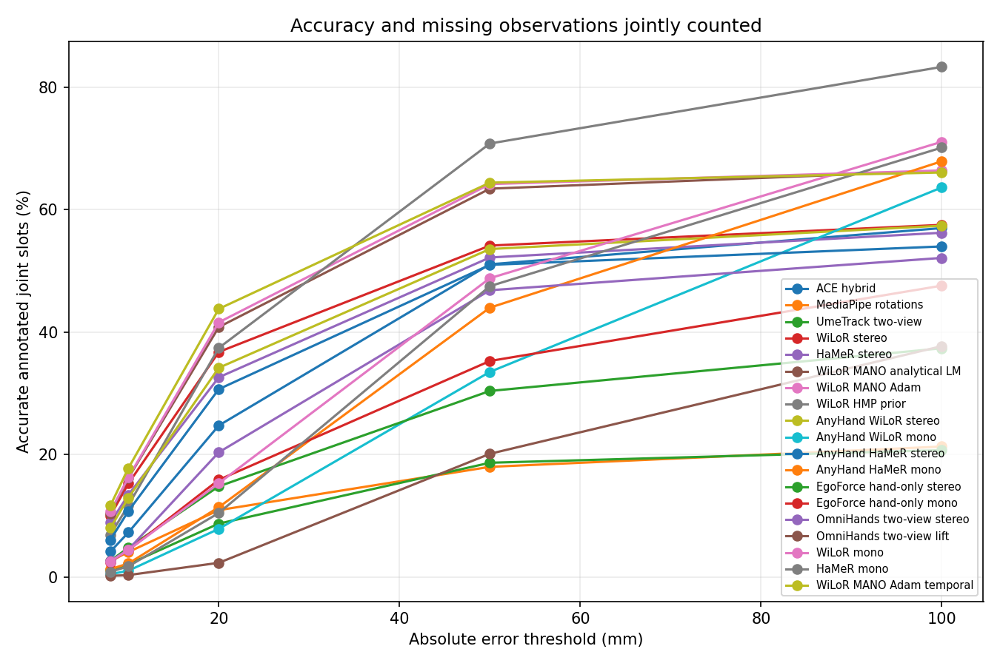

# Stereo hand-pose research: measured results and inference

Calibrated stereo hand reconstruction in metric camera coordinates, with executable
inference, participant-separated benchmarks, uncertainty intervals and error-overlap
analysis. **Recommended tested pipeline: WiLoR stereo → MANO Adam fitting → 50 ms
local temporal refinement.** The sub-10 mm / >95% coverage targets remain unmet.

This README contains the full measured comparison and execution limits. Tables
come from committed experiment JSON, not published paper numbers.

- [Recommended inference command](#inference-and-reproducibility)
- [Installation and input/output contract](#installation-and-inputoutput-contract)
- [Anatomical held-out results](#anatomical-mano-21-held-out-comparison)
- [ACE alone versus stereo](#ace-ego-hand-alone-versus-stereo)
- [SHOW3D results](#show3d-cross-dataset-check)
- [Error overlap](#correlated-errors-and-complementary-information)
- [How to exploit model complementarity](#how-model-complementarity-could-improve-reconstruction)
- [Executed methods and blockers](#execution-matrix-and-remaining-blockers)
- [Full research report](reports/final_research_report.md)

## Recommendation

Use **WiLoR observations in both calibrated views → confidence-gated stereo
triangulation → MANO fitting with Adam → 50 ms local-linear temporal refinement**
for the best tested accuracy/coverage compromise. This recommendation is an
engineering choice across several metrics, not the winner of every individual
metric or proof of global state of the art.

On 450 held-out HOT3D frames from three participants, the anatomical MANO-21
reference gives **24.27 mm absolute MPJPE,
29.94 mm wrist error, 26.98 mm fingertip error,
67.33% joint coverage and 35.64 mm P90**.
Median error is 14.60 mm. Complete 21-joint frame coverage is also
67.33%. **The requested sub 10 mm and 95% coverage
targets were not achieved.** Wrist orientation remains unavailable in the CLI.

Raw WiLoR stereo has lower observed MPJPE on fewer joints; HaMeR stereo has
better wrist/fingertip errors than the recommended fitted pipeline. HMP has 100%
coverage and wins the original 100 mm-capped missing-penalty score, but makes much
less accurate poses. There is no single dominating model. The full tables and
threshold curves expose this tradeoff instead of silently changing the metric.

## Protocol and limits

HOT3D Quest stereo is monochrome, not RGB. SHOW3D and EgoStandard provide
RGB checks; grayscale-to-RGB replication does not make HOT3D color video.
All absolute metrics use meters in the original left camera optical frame,
converted to millimeters for reporting, with **no root, scale, rigid or
Procrustes alignment**. Missing predictions remain NaN. Capped 100 means
mean(min(error, 100 mm)), with every missing annotated joint assigned 100 mm.
Coverage refers to annotated joint slots unless explicitly called frame coverage.

HOT3D development:450 frames/P0003, P0013, P0018. Held-out:450 frames/P0010, P0017, P0021.
Smoke:P0002/30 frames. These are public training-partition clips, split by
participant for this project; no hidden test labels were used. Prior round
held-out results were already known. Expanded model/fitting configurations were
committed in`e14f95e` before their held-out runs; the later development-selected
50 ms refinement was committed in`2b26be5` before applying it to held-out outputs.
No held-out values were used to tune numerical settings, but this is iterative
research on a reused small test set, not a fresh blind evaluation.

Native UmeTrack annotations only permit 19 common joints. MANO-21 is a **separate
anatomical reference**, never mixed with native 19 scores. UmeTrack lacks an
interchangeable anatomical wrist/thumb CMC and those remain missing. Pretrained
contamination is possible: ACE explicitly uses HOT3D and StableHand has HOT3D
weights. Complete checkpoint training-participant provenance is not established.

## Anatomical MANO-21 held-out comparison

| Method | Absolute MPJPE mm | Wrist mm | Fingertips mm | Joint coverage % | P90 mm | Capped 100 mm |
|---|---:|---:|---:|---:|---:|---:|
| ACE hybrid | 27.18 | 30.90 | 25.82 | 58.01 | 52.09 | 57.41 |
| MediaPipe rotations | 46.26 | 36.61 | 38.38 | 23.20 | 86.62 | 84.42 |
| UmeTrack two-view | 34.83 | — | 40.98 | 20.11 | 67.40 | 86.34 |
| WiLoR stereo | 22.89 | 21.38 | 30.96 | 58.12 | 40.93 | 53.75 |
| HaMeR stereo | 23.05 | 18.74 | 24.90 | 57.23 | 44.87 | 55.37 |
| WiLoR MANO analytical LM | 24.98 | 27.44 | 28.82 | 67.33 | 40.17 | 46.61 |
| WiLoR MANO Adam | 24.90 | 30.03 | 28.16 | 67.33 | 37.57 | 46.22 |
| WiLoR HMP prior | 55.36 | 64.70 | 58.17 | 100.00 | 144.70 | 41.28 |
| AnyHand WiLoR stereo | 23.57 | 18.28 | 33.96 | 57.98 | 43.08 | 54.42 |
| AnyHand WiLoR mono | 56.93 | 54.67 | 62.49 | 71.56 | 103.81 | 67.68 |
| AnyHand HaMeR stereo | 25.03 | 17.90 | 39.10 | 54.92 | 42.52 | 57.09 |
| AnyHand HaMeR mono | 48.28 | 63.88 | 51.96 | 71.56 | 86.90 | 61.72 |
| EgoForce hand-only stereo | 52.73 | 25.37 | 59.08 | 40.53 | 83.40 | 73.46 |
| EgoForce hand-only mono | 82.30 | 87.55 | 87.35 | 65.76 | 235.40 | 69.52 |
| OmniHands two-view stereo | 29.29 | 30.58 | 35.90 | 52.85 | 52.30 | 62.15 |
| OmniHands two-view lift | 102.46 | 88.38 | 108.89 | 69.78 | 187.72 | 80.49 |
| WiLoR mono | 40.51 | 52.81 | 44.41 | 71.56 | 69.90 | 57.29 |
| HaMeR mono | 44.44 | 53.02 | 50.47 | 71.56 | 72.30 | 59.27 |
| WiLoR MANO Adam temporal | 24.27 | 29.94 | 26.98 | 67.33 | 35.64 | 45.69 |

Relative to ACE, the recommendation improves the capped score by
11.72 mm; paired sequence-bootstrap 95% CI
[6.68, 15.04]mm
for ACE minus recommended. Only three clusters are available: intervals are
coarse and cannot establish broad generalization. Full paired comparisons,
including differences statistically indistinguishable from zero, are in
[the anatomical comparison JSON](reports/expanded_held_mano21/comparison.json).

The recommendation's PA-MPJPE is 8.79 mm, reported separately;
it is **not** its absolute positional accuracy.

## ACE-Ego-Hand alone versus stereo

These three configurations use the **same 450 held-out HOT3D frames and common
19-joint reference**. They are separate from the anatomical MANO-21 table above.

| ACE configuration | Absolute MPJPE mm | PA-MPJPE mm, aligned | Joint coverage % |
|---|---:|---:|---:|
| ACE auxiliary direct-3D head (historical diagnostic) | 107.48 | 8.69 | 72.00 |
| ACE gated stereo | 30.03 | 13.74 | 56.76 |
| ACE hybrid | 28.28 | 12.75 | 57.65 |

The historical ACE auxiliary head predicts a much better aligned hand configuration than absolute
metric placement: **107.48 mm absolute error versus 8.69 mm after Procrustes
alignment**. Alignment changes translation, rotation and scale, so this gap must
not be attributed entirely to depth. ACE's 2D observations remain useful: calibrated
stereo reduces absolute error to **30.03 mm**, then spatial/temporal refinement
to **28.28 mm**. This conclusion applies to the tested checkpoint and protocol.
[Machine-readable ACE results and source hashes](reports/ace_standalone_held.json).

**Reproduction audit correction:** the 107.48 mm entry decoded
`joints_cam_direct`, which bypasses ACE's final MANO and camera-translation
decoder. It should not have been presented as the complete official output.
Rescoring the final decoder on the same 450 frames with anatomical **MANO-21**
gives 111.08 mm absolute MPJPE, 114.01 mm wrist error, 17.42 mm wrist-relative
MPJPE, and 72.00% coverage. Thus the output-selection mismatch does not by itself
explain the placement problem. The 19- and 21-joint numbers remain separate.
[Audit measurements](reports/ace_audit/saved_decode.json) and
[paper-protocol scoring](reports/ace_audit/paper_protocol.json) preserve the
historical outputs. The paper's penalized wrist-relative metrics are not absolute
MPJPE. WiLoR's baseline is unchanged.

Fresh K-given inference on **three sequences × 81 identical frames** confirms
the placement problem:

| Input | Absolute MANO-21 MPJPE mm | Wrist mm | Wrist-relative MPJPE mm | Coverage % |
|---|---:|---:|---:|---:|
| 640×640, 81 frames | 108.18 | 113.62 | 16.45 | 77.37 |
| 480×480, 81 frames | 142.31 | 135.29 | 18.69 | 77.37 |

On shared observed joints, 480 pixels worsens error by **34.45 mm**
(three-sequence bootstrap 95% interval: +20.37 to +78.98 mm). Fresh 640-pixel
inference differs from archived predictions by only +0.36 mm on this subset.
The 480-pixel run follows the paper's stated input size but does not reproduce
its undisclosed split or rectification. Dataset/pretraining overlap is unknown;
exact parity with the unreleased author evaluator is not claimed.
[Full ACE audit, published-metric comparisons, coordinate checks and limitations](reports/ace_audit/report.md).

## All executed expanded held-out variants: common19

| Method | Abs MPJPE mm | Wrist mm | Tips mm | Coverage % | P90 mm | Capped 100 mm |
|---|---:|---:|---:|---:|---:|---:|
| ACE hybrid | 28.28 | — | 25.97 | 57.65 | 53.10 | 58.28 |
| MediaPipe rotations | 47.80 | — | 38.04 | 23.26 | 88.80 | 84.52 |
| UmeTrack two-view | 34.65 | — | 41.11 | 22.22 | 67.20 | 84.86 |
| WiLoR stereo | 23.91 | — | 30.84 | 58.21 | 42.90 | 54.13 |
| HaMeR stereo | 24.23 | — | 24.97 | 57.18 | 46.65 | 56.01 |
| WiLoR MANO analytical LM | 25.69 | — | 28.78 | 67.33 | 41.73 | 47.14 |
| WiLoR MANO Adam | 25.31 | — | 28.18 | 67.33 | 38.41 | 46.54 |
| WiLoR HMP prior | 55.42 | — | 58.33 | 100.00 | 146.93 | 41.05 |
| AnyHand WiLoR stereo | 24.89 | — | 34.22 | 58.05 | 45.22 | 55.01 |
| AnyHand WiLoR mono | 57.50 | — | 61.96 | 71.56 | 102.82 | 68.07 |
| AnyHand HaMeR stereo | 26.53 | — | 38.96 | 54.88 | 44.21 | 57.77 |
| AnyHand HaMeR mono | 47.11 | — | 51.57 | 71.56 | 84.16 | 61.04 |
| EgoForce hand-only stereo | 55.95 | — | 59.16 | 40.41 | 86.23 | 74.31 |
| EgoForce hand-only mono | 82.93 | — | 87.62 | 65.84 | 236.40 | 69.67 |
| OmniHands two-view stereo | 29.92 | — | 36.12 | 53.11 | 53.98 | 62.28 |
| OmniHands two-view lift | 103.86 | — | 108.19 | 69.78 | 190.26 | 80.84 |
| WiLoR mono | 39.93 | — | 44.17 | 71.56 | 69.77 | 56.96 |
| HaMeR mono | 44.04 | — | 50.07 | 71.56 | 71.36 | 59.05 |
| WiLoR MANO Adam temporal | 24.68 | — | 26.93 | 67.33 | 36.28 | 46.05 |

POEM was measured on development but did not advance. The original RTMPose,
MediaPipe/RTMPose fusion and dense-stereo pilots cover smaller subsets and are
retained in[the first-round report](reports/round_one_research_report.md), not pooled
into this 450-frame leaderboard. Monocular variants use calibrated translation
fitting from the predicted metric mesh; they do not use true scale or true crops.
OmniHands “lift” uses two image views and calibrated translation; it is not
monocular and its released network does not consume the stereo calibration.

## Development results and what improved

| Method | Abs MPJPE mm | Wrist mm | Tips mm | Coverage % | P90 mm | Capped 100 mm |
|---|---:|---:|---:|---:|---:|---:|
| ACE hybrid | 25.97 | — | 31.17 | 50.42 | 41.53 | 61.44 |
| MediaPipe rotations | 120.18 | — | 103.00 | 55.13 | 610.73 | 63.82 |
| UmeTrack two-view | 86.65 | — | 89.94 | 49.33 | 70.75 | 65.29 |
| POEM two-view | 163.70 | — | 160.62 | 60.89 | 654.12 | 68.58 |
| WiLoR stereo | 30.84 | — | 34.47 | 51.72 | 38.42 | 58.28 |
| WiLoR mono | 96.18 | — | 100.83 | 57.33 | 141.70 | 75.62 |
| AnyHand WiLoR stereo | 37.98 | — | 42.70 | 51.50 | 44.19 | 60.16 |
| AnyHand WiLoR mono | 108.40 | — | 114.45 | 57.33 | 173.61 | 83.46 |
| HaMeR stereo | 34.06 | — | 33.85 | 50.98 | 40.76 | 59.27 |
| HaMeR mono | 100.39 | — | 106.25 | 57.33 | 151.65 | 79.75 |
| AnyHand HaMeR stereo | 36.86 | — | 35.74 | 51.13 | 41.06 | 59.39 |
| AnyHand HaMeR mono | 94.95 | — | 100.78 | 57.33 | 133.13 | 78.59 |
| EgoForce hand-only stereo | 36.20 | — | 44.93 | 47.53 | 52.56 | 64.17 |
| EgoForce hand-only mono | 61.56 | — | 65.81 | 55.54 | 58.39 | 62.04 |
| OmniHands two-view stereo | 39.80 | — | 41.53 | 49.39 | 53.52 | 64.49 |
| OmniHands two-view lift | 111.45 | — | 117.64 | 56.22 | 148.41 | 88.88 |
| WiLoR MANO analytical LM | 33.46 | — | 35.48 | 54.89 | 37.34 | 55.01 |
| WiLoR MANO Adam | 32.25 | — | 33.01 | 54.89 | 27.01 | 54.36 |
| WiLoR HMP prior | 35.34 | — | 35.55 | 66.67 | 107.17 | 52.45 |
| EgoForce forearm stereo | 33.84 | — | 40.40 | 46.32 | 49.31 | 64.74 |
| EgoForce forearm mono | 50.80 | — | 53.66 | 54.06 | 49.96 | 60.95 |

The analytical ParaFit solver is the released UA-Fit optimizer core, initialized
with predicted WiLoR pose/shape and observations. Adam uses the same measured 2D,
stereo 3D and pose-prior objective. Shared subject shape is the median of predicted
betas, never GT shape. Adam runs 200 steps/lr 0.005, reprojection precision 0.25,
stereo weight 10000 and pose weight 0.1; analytical LM runs 30 iterations. Complete
fitted joints may be inferred from anatomy and must not be called directly
stereo-observed. Analytical LM and Adam are close; inspect paired intervals
rather than treating their small difference as decisive. On anatomical held-out
data, LM minus Adam is 0.39 mm capped score (95% CI[-0.33, 1.16]); Adam minus
50 ms refinement is 0.52 mm (CI[-0.70, 1.75]). Both intervals include zero: these
small improvements are statistically indistinguishable under this three-sequence
bootstrap, despite the point-estimate ranking.

A development-only ensemble sweep tried ordered source pairs, weights 0.25/0.5/0.75,
agreement gates 2/5/10cm, and optional 100 ms smoothing. Best capped score 54.91 mm
was worse than MANO Adam 54.36 mm and HMP52.45 mm; its observed MPJPE86.40 mm included
large errors. It was rejected before held-out execution. No GT oracle is deployed.

The learned HMP prior is an actual latent-optimization experiment using released
Dyn-HaMR weights, with known camera trajectories and predicted WiLoR pose/shape.
It is **not full Dyn-HaMR**. It fills long missing spans and achieves 100% held-out
coverage, but approximately 55 mm observed error and 145 mm P90. Appearance of smooth
motion is insufficient evidence of correct metric position.

For the fitted pipeline, 50 ms local refinement improved development error
32.25→31.74 mm without increasing coverage.100 ms and 200 ms spread failures and
worsened observed error. On held-out common 19, 50 ms improved 25.31→24.68 mm at
unchanged 67.33% coverage. Per-sequence acceleration error fell from
20.54/40.72/16.37 to 7.02/18.27/6.13 m/s² against the anatomical reference.
These are camera-frame metrics on valid triplets, not world-motion stability. Both smoothed/inferred and original observation masks
are preserved. The time window is a ±50 ms neighborhood; gaps must be bracketed
and at most 100 ms, and at least 3 observations are needed.

FoundationStereo was executed in round one. The calibrated dense-depth pilot
showed a small single-sequence gain; dense+MANO changed 23.865→23.771 mm at equal
coverage. This is insufficient evidence to add it to the selected pipeline.
No new model training was performed.

## SHOW3D cross-dataset check

The same 900development frames from three distinct SHOW3D scenes were evaluated,
using predicted crops and each frame's official camera transforms. Configurations
were transferred from HOT3D. This is an external development check, not the
unexecuted SHOW3D held-out partition; its annotation convention is separate.

| Method | Abs MPJPE mm | Wrist mm | Tips mm | Coverage % | P90 mm | Capped 100 mm |
|---|---:|---:|---:|---:|---:|---:|
| MediaPipe rotations | 20.49 | — | 26.88 | 13.50 | 41.57 | 89.26 |
| ACE hybrid | 30.13 | — | 33.39 | 60.94 | 58.77 | 57.40 |
| WiLoR stereo | 20.70 | — | 22.65 | 60.19 | 36.95 | 51.28 |
| HaMeR stereo | 20.51 | — | 23.22 | 58.10 | 37.30 | 52.90 |
| WiLoR MANO analytical LM | 22.03 | — | 23.61 | 79.22 | 39.43 | 37.30 |
| WiLoR MANO Adam | 21.19 | — | 22.95 | 79.22 | 38.83 | 36.65 |
| WiLoR MANO Adam temporal | 19.53 | — | 20.47 | 82.78 | 35.57 | 32.79 |

## Correlated errors and complementary information



A failure means missing or>20 mm. Spearman correlation uses **only jointly observed
joints**; Jaccard measures overlap of failure sets including misses. Joint samples
are correlated, so these descriptive correlations are not independent-sample
significance tests.

| Pair | Error Spearman | Failure Jaccard | Both missing % | Error-vector cosine |
|---|---:|---:|---:|---:|
| ACE hybrid vs WiLoR stereo | 0.21 | 0.64 | 32.87 | 0.28 |
| ACE hybrid vs WiLoR MANO Adam | 0.24 | 0.63 | 29.75 | 0.31 |
| WiLoR stereo vs HaMeR stereo | 0.52 | 0.74 | 36.89 | 0.61 |
| WiLoR stereo vs AnyHand WiLoR stereo | 0.55 | 0.76 | 37.23 | 0.60 |
| HaMeR stereo vs AnyHand HaMeR stereo | 0.46 | 0.75 | 37.93 | 0.56 |
| WiLoR stereo vs WiLoR MANO Adam | 0.57 | 0.73 | 32.30 | 0.70 |
| WiLoR MANO analytical LM vs WiLoR MANO Adam | 0.84 | 0.86 | 32.67 | 0.87 |
| WiLoR MANO Adam vs WiLoR MANO Adam temporal | 0.92 | 0.89 | 32.67 | 0.93 |

ACE and WiLoR provide partly different localization errors, yet often fail on the
same hard observations. WiLoR, HaMeR and their AnyHand variants share the WiLoR
hand detector/crop protocol here; correlated misses therefore cannot be attributed
solely to their pose networks. Their related mesh regressors also predict 2D by
projecting a reconstructed hand, so their landmark errors are not independent
heatmap evidence. AnyHand fine-tuning did not improve the overall held-out metric
versus the corresponding original stereo models.

On development, the WiLoR/AnyHand-WiLoR monocular error correlation was 0.976,
consistent with strongly shared depth/scale weaknesses. Stereo reduces that
ambiguity using the known metric baseline. The detector scores are not calibrated
per-joint uncertainty, which limits simple confidence-weighted fusion.

For held-out ACE/WiLoR, a GT-selecting per-joint oracle reaches 45.71 mm capped
score versus 54.13 mm for raw WiLoR. That is diagnostic headroom, **not an executable
pipeline**; the tested deployable fusion did not realize it. Detailed per-sequence
and per-joint overlap statistics are in[the overlap JSON](reports/error_overlap_held.json).



- WiLoR MANO Adam temporal: 43.79% of all annotated common 19 slots within 20 mm, counting misses as failures.
- WiLoR stereo: 36.76% of all annotated common 19 slots within 20 mm, counting misses as failures.
- ACE hybrid: 24.76% of all annotated common 19 slots within 20 mm, counting misses as failures.
- WiLoR HMP prior: 37.42% of all annotated common 19 slots within 20 mm, counting misses as failures.

The per-frame mean error decomposition finds that much of MANO-fitting residual
energy is shared translation, rather than independent finger distortion. For
unsmoothed MANO Adam, 94.5% of squared error is in this common component and 65.2%
in the depth axis. These are unaligned diagnostic decompositions, heavily affected
by outliers, not causal estimates or improvements applied to predictions.

Inspected failures include a hand cut by the image border, overlapping hands,
and a catastrophic stereo-depth/fit failure onclip 001035 frame 42 exceeding 1m.
A plausible projected skeleton does not certify depth. The recommendation still
has serious tails and coverage gaps; no post-hoc GT-based frame deletion was used.
[Worst-case overlays](reports/expanded_analysis/failures/index.json) retain these cases.

### How model complementarity could improve reconstruction

**These are research proposals, not demonstrated improvements to the selected
pipeline.** The useful signal is conditional reliability: identify when one method
is right and another is wrong. Correlation alone does not supply that selector.

| Opportunity | Measured motivation | Proposed next experiment |
|---|---|---|
| ACE + WiLoR observation selection | Weak observed-error correlation (0.21), but shared misses remain substantial | Select or weight per-joint 2D hypotheses using geometry and uncertainty before joint stereo fitting |
| Separate global placement from articulation | MANO Adam residuals have a large common-translation component | Estimate metric palm/wrist position and depth separately from the fitted finger configuration |
| Use disagreement to flag unreliable observations | Related mesh methods share many failures; disagreement can expose inconsistent predictions | Test disagreement together with reprojection, ray geometry, hand identity and temporal evidence |
| Keep short temporal refinement | The 50 ms refinement improved point estimates and acceleration error; unsmoothed/smoothed errors correlate at 0.92 | Preserve short, bounded refinement; do not expect smoothing to recover independent missing information |

An inference-time selector could use epipolar and reprojection residuals,
triangulation uncertainty (especially depth), independent-view agreement, image
boundary proximity, changes in bone lengths, temporal innovations and right-hand
identity consistency. **Low reprojection error alone is not sufficient:** a
plausible image projection can still have severely incorrect metric depth.
Agreement is also not proof of correctness when models share a detector or prior.

The ACE/WiLoR ground-truth oracle's 54.13 to 45.71 mm capped-score improvement
shows potential complementary information, not an achievable measured gain from
these proposals. The tested simple confidence/agreement fusion did not realize
that gain and was rejected. A new selector must be developed on more independent
episodes and assessed on a fresh held-out set; only three development and three
held-out HOT3D sequences were used here. Frames and joints are correlated samples,
not thousands of independent episodes. The small solver and smoothing improvements
also have confidence intervals that include zero.

## Smaller baseline and optimization pilots

These runs use different subsets and must **not** be ranked against the 450-frame
leaderboards as though they evaluated the same observations. Smoke clips have
30 frames; the development pilots below use clip-000175 (150 frames). Dense smoke
runs marked invalid in the experiment ledger are excluded.

| Recorded artifact / variant | Absolute MPJPE mm | Joint coverage % | Capped 100 mm |
|---|---:|---:|---:|
| `outputs/b0-dev/clip-000175/metrics.json` | 27.10 | 75.96 | 42.45 |
| `outputs/b0-smoke/clip-000000/metrics.json` | 21.87 | 28.07 | 78.07 |
| `outputs/b1-ablations-dev/results.json / temporal_0.033` | 15.00 | 49.65 | 57.78 |
| `outputs/b1-ablations-dev/results.json / temporal_0.067` | 13.89 | 53.89 | 53.59 |
| `outputs/b1-ablations-dev/results.json / temporal_0.1` | 13.72 | 54.39 | 53.07 |
| `outputs/b1-ablations-dev/results.json / mano` | 22.36 | 70.67 | 45.03 |
| `outputs/b1-mpcrop-dev/clip-000175/metrics.json` | 15.00 | 49.65 | 57.78 |
| `outputs/b1-smoke/clip-000000/metrics.json` | — | 0.00 | 100.00 |
| `outputs/b2-dev/clip-000175/metrics.json` | 27.53 | 76.25 | 42.14 |
| `outputs/dense-dev/results.json / stereo` | 27.10 | 75.96 | 42.45 |
| `outputs/dense-dev/results.json / surface_depth_at_landmarks` | 34.30 | 79.16 | 47.76 |
| `outputs/dense-dev/results.json / conservative_depth_fusion` | 26.63 | 75.96 | 42.09 |
| `outputs/dense-mano-dev/results.json / stereo_mano` | 23.86 | 85.33 | 35.02 |
| `outputs/dense-mano-dev/results.json / stereo_depth_mano` | 23.77 | 85.33 | 34.94 |

All recorded first-round measurements, protocol exclusions and artifact hashes
are in the [experiment ledger](reports/experiment_metrics.json). The
[development fusion grid](reports/fusion_development.json),
[fitted temporal sweep](reports/fitted_temporal_development.json),
[POEM official demo verification](reports/poem_official_demo.json), and
[first-round report](reports/round_one_research_report.md) retain the additional
ablations and diagnostics. A demo with provided crops or GT shape is not a fair
predicted-input accuracy result.

## Execution matrix and remaining blockers

| Requested method/data | What actually executed | Limit |
|---|---|---|
| MediaPipe, RTMPose, detector fusion | Stereo baseline pilots and full MediaPipe comparisons | RTMPose/fusion pilots are smaller subsets |
| ACE | Official calibrated inference per view; mono/stereo/hybrid, HOT3D and SHOW3D | HOT3D pretraining contamination possible |
| POEM-v 2 | Official demo plus predicted-crop two-camera development benchmark | Demo's provided crops are not fair benchmark evidence |
| UA-Fit | Actual released ParaFit analytical optimizer; matched Adam objective | Learned uncertainty checkpoint not located; not full UA-Fit |
| UmeTrack | Official smoke plus adapted two-view predicted-crop benchmark | Not a four-camera result; wrist convention differs |
| FoundationStereo | Rectified dense-depth and surface+MANO pilots | No convincing cross-sequence gain established |
| WiLoR, HaMeR | Released weights, predicted crops, mono/stereo, HOT3D and SHOW3D | Projected mesh landmarks, shared detector |
| AnyHand | Both released WiLoR and HaMeR fine-tuned checkpoints | Same detector/crops; no training performed |
| EgoForce | HALO hand-only stereo/mono; additional released-forearm-detector development ablation | Adapted hand detector; not official temporal/TensorRT tracker |
| OmniHands | Released multiview checkpoint with two predicted-crop views | Calibration used after network; missing opposite hand uses full-image crop |
| StableHand | Official cached-feature clip 002736 demo, 20 steps/seed 42 | GT shape conditioning; unreleased preprocessing; excluded from fair leaderboard |
| Dyn-HaMR | Released HMP prior, actual latent optimization | Full camera/hand optimization pipeline not reproduced |
| EgoHandICL | Repository and pinned HF release inspected | Referenced handicl.egohandicl_new module and usable released checkpoint not located; no inference claimed |
| HOT3D | 30smoke+450development+450held-out frames | Only 3 held-out participants, reused test set |
| facebook/show 3d-dataset | 900-frame multi-method development comparison | SHOW3D held-out partition not evaluated |
| LightwheelAI/EgoStandard | Authorized stereo sample downloaded;547-frame inference | Anatomical joint ordering/pose units remain unverified; no quantitative GT accuracy |

StableHand's measured demo world MPJPE was 44.17 mm (right 47.13 mm); PA2.63 mm is
separate. This protocol conditions on GT shape and cached features, so it is not
ranked with predicted-input stereo methods. The supplied EgoStandard dataset card
does not resolve joint semantics. No access restrictions were bypassed.

## Inference and reproducibility

```bash
.venv-extra/bin/python scripts/run_inference.py \
  --model wilor --mano-fit adam --temporal-seconds .05 \
  --left data/example/left.mp4 --right data/example/right.mp4 \
  --calibration data/example/calibration.json --output outputs/example-wilor
```

Add`--rotate-cw` for native sideways HOT3D only; optionally provide synchronized
nanosecond timestamps. Input must be calibrated pinhole stereo (undistort first).
Output coordinates retain the original left optical frame, +x right, +y down, +z
forward, meters, canonical 21-joint order. All required NPY/NPZ/metadata/video files
are exported, without GT. Wrist rotations are NaN. Saved MANO parameters are
predicted initializers, not fitted output parameters. Original stereo, anatomical
fit and temporal provenance are distinct; confidence is not a calibrated joint
probability. The bare CLI default remains the lightweight MediaPipe baseline;
use the explicit command above for the recommendation.

Pinned source commits, checkpoint hashes, release revisions, environment versions
and all experiment configurations are under`configs/`. See[setup details](docs/model_setup.md).
26 weight-free regression tests pass, including actual video decode/encode and
metric export through both lightweight and mesh CLI routes. A real 30-frame GPU
inference integration also passed. Clean heavy-model installation on a different
machine is not certified; recorded compatibility changes and environment snapshots
make the tested environment auditable.

Concurrent benchmark timings include different startup/caching loads and are not
used to rank speed. Dedicated CLI profiles are reported separately when available;
device-wide sampled GPU memory is not exact allocator peak. Accuracy was prioritized.

## Further research justified by these results

Prioritize reliable right-hand identity under overlap/cropping, calibrated
landmark uncertainty, and depth-outlier rejection learned/tuned only on fresh
development data. Test a wrist/translation initializer independently from finger
articulation rather than averaging whole related meshes. Obtain more unseen
participants and verify pretrained-data overlap before generalizing this ranking.
A broader dense-depth or learned temporal study is justified only with accurate
visible-surface association and explicit missing-frame scoring. EgoStandard needs
authoritative joint/coordinate documentation before anatomical benchmarking.

Dedicated final 30-frame CLI: exit 0, wall time 25.85 s, peak sampled device memory[3368]MiB (cold process, includes startup).

EgoStandard unsmoothed WiLoR+MANO integration: 547 frames, 81.90% valid output joint slots. No GT accuracy is inferred from this coverage.

### Recorded expanded-run timing (not controlled speed ranking)

| Method | Mean seconds/frame, both reconstruction variants |
|---|---:|
| WiLoR | 0.113 |
| HaMeR | 0.124 |
| EgoForce hand-only | 0.230 |
| OmniHands | 0.249 |

These per-frame timers exclude model startup and input decoding, include mono/lift plus stereo export computation, and ran with concurrent jobs. MANO fitting and temporal refinement add work. Use the dedicated end-to-end CLI profile for the deployable pipeline; no controlled all-model steady-state speed claim is made.

## Installation and input/output contract

<!-- BEGIN INSTALLATION -->

Python 3.12:

```bash
python3.12 -m venv .venv
source .venv/bin/activate
pip install -e '.[test,baseline]'
pytest -q
python scripts/setup_environment.py
python scripts/run_inference.py --left left.mp4 --right right.mp4 --calibration calibration.json --output outputs/example
```

Videos must already be synchronized, equal frame rate and frame count. Optional
`--timestamps timestamps.npz` supplies `left` and `right` nanosecond arrays;
default timestamps are nominal FPS from zero and do not verify physical sync.

Calibration JSON declares `units: "meters"`,
`transform_convention: "T_camera_from_left"`, and `left`/`right` objects with
`K` (3x3), `T_camera_from_left` (4x4), `distortion` (OpenCV coefficients),
`model` (`opencv` or `fisheye`). Left transform is identity. For a right camera
located 10 cm to the right with identical orientation, right T[0,3] = -0.1.
HOT3D FISHEYE624 requires the official toolkit adapter, not OpenCV fisheye.

Outputs use left optical coordinates (+x right, +y down, +z forward), meters.
Missing joints and unavailable wrist rotation are NaN; validity is explicit.
Order is wrist then thumb/index/middle/ring/pinky proximal-to-tip, 4 per finger.
Thumb anatomy is CMC/MCP/IP/tip. Confidence currently comes from MediaPipe's
handedness classifier for the MediaPipe baseline; other models document their
score semantics in metadata. None is calibrated per-joint uncertainty.

Evaluate matching NPZ predictions and GT with `handpose-evaluate --predictions
pred.npz --ground-truth gt.npz --output metrics.json`. Both require matching
`frame_ids`, `timestamps`, `joints_3d`, `validity`. Absolute and aligned metrics
are separate. Missing joints count against coverage and the capped 100 mm loss.

Data, checkpoints, third-party clones and generated outputs are excluded from Git.
See PROGRESS.md and reports for actual execution status and limitations.

Actual dataset adapters:

```bash
# On a PyTorch-enabled research environment, install the pinned official toolkit
# from configs/sources.lock.json, plus webdataset==0.2.111.
python scripts/prepare_hot3d.py
python scripts/benchmark_hot3d.py --split smoke --output outputs/b0-smoke
# SHOW3D: huggingface_hub==0.36.0 pyarrow==19.0.1
python scripts/prepare_show3d.py
python scripts/benchmark_hot3d.py --manifest data/show3d/manifest.json --split development --model mediapipe_rotated --output outputs/show3d-dev
```

The public datasets' native UmeTrack annotations have a different wrist definition
and no thumb CMC. The default comparison therefore measures **19 common joints**.
`evaluate_mano_gt.py` provides a separate 21-joint MANO annotation track once
legitimately obtained MANO files have been supplied. Do not merge these leaderboards.

HOT3D native images need a clockwise rotation for upright video models. The
`export_stereo_example.py --upright` helper rotates optical coordinates as well;
ACE export evaluation inversely maps predictions back to the original camera.
SHOW3D is already upright. Its per-frame world transforms refer to a moving rig,
not static physical world. The reader checks pose validity and GT reprojection.

EgoStandard access and schema audit:

```bash
hf buckets cp 'hf://buckets/LightwheelAI/EgoStandard/EgoStandard/mcap/wipe the keyboard/2b5d4457-b40c-4dbd-973c-4fdd82f9e06f.mcap' data/egostandard/sample.mcap
pip install mcap==1.3.0 lz4==4.4.5 zstandard==0.25.0
python scripts/inspect_egostandard.py data/egostandard/sample.mcap --output outputs/egostandard-inspection
```

The bucket is mutable; the inspector records SHA-256. This sample has paired RGB
streams, camera calibrations, 21-transform hand poses and bad-frame annotations.
Its joint names and pose units still require authoritative confirmation. It is
not yet an accuracy benchmark. `handpose.data.egostandard` requires explicit
joint names and units, validates world-to-camera conversion, and preserves
unmatched timestamps as missing. Linked EgoDemo technical documentation requires
separate access not available in the VM's current session.

Offline ACE stereo inference (separate model environment and released assets):

```bash
python scripts/run_inference.py --model ace \
  --left data/example/left.mp4 --right data/example/right.mp4 \
  --calibration data/example/calibration.json \
  --timestamps data/example/timestamps.npz --rotate-cw \
  --anatomy-weight 1 --temporal-seconds 0.1 --output outputs/ace-example
```

Use `--rotate-cw` for native HOT3D Quest images. Outputs remain in the original
left camera frame. `--temporal-seconds 0.1` enables offline local-linear refinement
with gaps capped at 0.1 seconds. Combined with `--anatomy-weight 1`, these are
the frozen ACE hybrid settings evaluated on held-out participants.
`--ace-left-export` and `--ace-right-export` reuse trusted local official ACE
pickle exports for regression checks; they are not required for inference.
Nonzero-distortion video must first be undistorted with matching calibration.

`configs/environments/` records the actually executed VM package versions;
`configs/checkpoints.lock.json` and `configs/models/expanded_checkpoint_hashes.json` record downloaded checkpoint identities.
These environment snapshots include inherited system packages and are audit
records, not yet a one-command research-model installer. The baseline installation
above is the supported clean installation path. Large-model setup remains partly
manual and is described in the research report.

Heavy-model setup details: [docs/model_setup.md](docs/model_setup.md).
Verify downloaded model bytes with `python scripts/verify_assets.py`; missing
optional model weights are reported explicitly. Use `--contains ace` to check a
subset. The complete executed model catalog is `handpose.models.registry.MODEL_SPECS`.

Dataset split identities, revisions and available hashes are tracked under
`configs/datasets/`. Frozen settings are in `configs/experiments/frozen_hot3d.yaml`, `expanded_frozen.json`, and `fitted_temporal_frozen.json`.

<!-- END INSTALLATION -->
