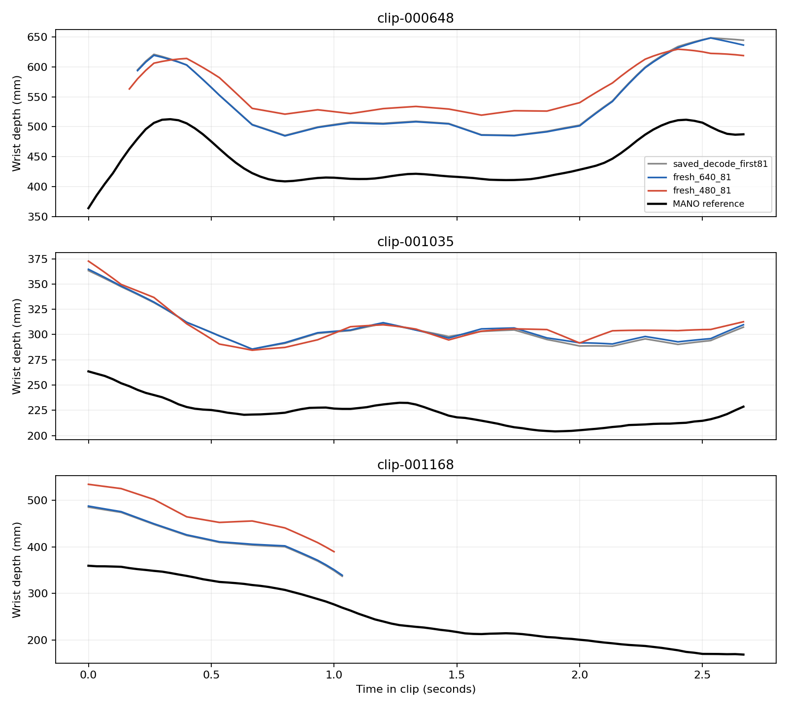

# ACE-Ego-Hand reproduction audit — 2026-10-08

The historical 107.48 mm result was an auxiliary-head measurement, not the complete official MANO output. Correcting that distinction does not resolve the large camera-frame placement error. Fresh official K-given inference reproduces the archived behavior. Keep the WiLoR stereo baseline.

## Executed experiments

Every row below uses anatomical MANO-21 and the right hand in metric left-camera coordinates. No alignment is applied to absolute MPJPE. Coverage includes all labeled frames, including off-screen hands; it is not paper detection recall.

| Run (pixels / input frames) | Scored frames | Absolute MPJPE mm | Wrist mm | Wrist-relative mm | PA mm | Coverage % |
|---|---:|---:|---:|---:|---:|---:|
| Archived held-out, 640 / 150 | 450 | 111.08 | 114.01 | 17.42 | 6.15 | 72.00 |
| Archived development, 640 / 150 | 450 | 136.95 | 135.15 | 12.40 | 5.60 | 56.00 |
| Archived held-out first 81 | 243 | 107.83 | 113.11 | 16.39 | 5.85 | 77.37 |
| Fresh held-out, 640 / 81 | 243 | 108.18 | 113.62 | 16.45 | 5.81 | 77.37 |
| Fresh held-out, 480 / 81 | 243 | 142.31 | 135.29 | 18.69 | 5.79 | 77.37 |

Six archived sequences contain 900 unique frames: three development (000175, 000838, 001119) and three held-out (000648, 001035, 001168), 150 each. The six fresh executions reuse the first 81 frames of the three held-out sequences: 243 unique frames, not six new episodes. The historical 107.48 mm common19 result remains a separate evaluation track.

## Paper-style metrics

MPJPE-p is wrist-relative; PA-p uses similarity alignment. CT-p measures MANO translation, not wrist position. Detection uses presence, on-screen gating and projected mesh overlap. Misses receive a canonical-hand cost; 2D misses receive the image diagonal. Published evaluation uses 437 81-frame segments and 480×480 inputs. [Paper, Table 1 and Appendix A](https://arxiv.org/html/2608.20308v3).

| Run | MPJPE-p mm | PA-p mm | EPE2D-p px | GO-p deg | CT-p m | Recall | F1 |
|---|---:|---:|---:|---:|---:|---:|---:|
| Published HOT3D K-given (different split) | 12.888 | 6.436 | 6.418 | 7.924 | 0.025 | 0.998 | 0.996 |
| Archived held-out 640 | 22.3990 | 6.7275 | 31.1890 | 17.9116 | 0.1204 | 0.9508 | 0.9748 |
| Archived development 640 | 39.7032 | 9.0869 | 139.1708 | 41.4389 | 0.1954 | 0.7982 | 0.8878 |
| Fresh held-out 640 / 81 | 24.5501 | 6.4157 | 41.3721 | 19.3541 | 0.1272 | 0.9372 | 0.9676 |
| Fresh held-out 480 / 81 | 25.6928 | 7.3558 | 31.1836 | 20.2072 | 0.1363 | 0.9465 | 0.9725 |

These scores evaluate both hands. The 640-pixel EPE columns are not directly comparable to the paper’s 480-pixel values. JSON also contains per-side counts, frame accuracy, matched-only metrics and sensitivity results.

**Exact evaluator parity is not certified.** Official upstream HEAD `59da83b` still lists evaluation and data preparation as unreleased. The implementation follows Appendix A.1, but the text does not fully resolve dilation semantics, side-selection order, or the canonical hand’s mean-pose convention. These choices are exposed and tested.

| Run | Default MPJPE-p | Flat-hand placeholder MPJPE-p | Default PA-p | Flat-hand placeholder PA-p |
|---|---:|---:|---:|---:|
| paper_protocol | 22.399 | 22.416 | 6.728 | 7.383 |
| development_paper | 39.703 | 43.529 | 9.087 | 9.685 |
| fresh_480_81_paper | 25.693 | 25.511 | 7.356 | 8.106 |
| fresh_640_81_paper | 24.550 | 24.374 | 6.416 | 7.286 |

Default canonical construction uses zero pose parameters with `flat_hand_mean=False`, matching ACE’s MANO convention. The flat-hand alternative is reported rather than hidden. Dilation and matching-order sensitivity are stored in each scoring JSON.

## Controlled differences and error decomposition

- fresh_480_81 minus fresh_640_81: +34.453 mm on shared observed joints; sequence-bootstrap 95% interval [+20.375, +78.977] mm; 3927 paired joints.
- fresh_640_81 minus saved_decode_first81: +0.356 mm on shared observed joints; sequence-bootstrap 95% interval [-1.565, +2.132] mm; 3948 paired joints.

Intervals resample three sequences, not independent frames. They describe this small local set and do not establish population-wide performance.

| Output | Wrist signed depth mm | Root MSE mm² | Articulation MSE mm² | Cross term mm² | Absolute MSE mm² |
|---|---:|---:|---:|---:|---:|
| saved_decode | 91.952 | 14353.624 | 419.773 | -1089.474 | 13683.923 |
| fresh_640_81 | 89.832 | 13646.644 | 363.228 | -1687.678 | 12322.195 |
| fresh_480_81 | 105.802 | 19576.310 | 469.267 | 1406.275 | 21451.853 |

For each joint, error equals wrist error plus wrist-relative error. Squared error decomposes into root, articulation and cross terms; MPJPE itself is not additive. The consistent positive wrist-depth bias survives final MANO decoding and both fresh resolutions.



## Verified conventions and provenance

- Official K-given checkpoint SHA256: `33f328624ca532942b12d10c59b648bb9fc0801bcdfe59f35ba92645e51fc3ad`. Fresh runs verify this hash before inference. All 605 trainable backbone tensors loaded; inference logs report no missing/unexpected keys.
- K-given uses supplied intrinsics in `mixed_pnp`; `self_ray_decode` defaults false. Exported `pred_intrinsics` is a diagnostic and does not turn this into a K-free run. `nv_sigma=0`, LoRA rank/alpha 64, tap 15.
- Quest3 OVR624 source cameras are 1280×1024. Official forward lens projection maps pinhole rays into the source images. Square pinhole views use focal=size/2 and principal point=(size−1)/2. This is our documented 90-degree horizontal-FOV choice, not a verified copy of the authors’ unpublished rectification.
- Clockwise upright rotation uses x′=−y, y′=x, z′=z. Its pixel transform commutes with projection. Input orientation was visually inspected. Frame timestamps are increasing with median period 33,333,333 ns.
- MANO-21 uses the anatomical wrist, 16 native joints and five mesh fingertips (744, 320, 443, 554, 671), in canonical finger order. The common19 UmeTrack reference is never substituted.
- Ground truth uses the official HOT3D MANO loader, including its left-hand shapedirs correction. ACE prediction decoding remains unchanged; its left model does not apply that correction. Right-hand absolute results are unaffected by this left-only distinction.
- For camera rotation C and translation t, MANO translation becomes Cτ+t+Cj₀−j₀, where j₀ is the shaped MANO root. Reexpressed meshes agree with directly transformed meshes below 0.00015 mm. Camera numerical round trips agree below 1e-9 pixels; these test implementation consistency, not physical recalibration of the rig.
- Fresh inference opens video images and camera calibration only. `hands.json` and subject shape are read by separate evaluation processes. No reference wrist, pose, box, or shape is supplied to inference.
- Raw outputs, input videos, run commands, hashes and logs are backed up under `outputs/ace-audit*`; [artifact manifest](artifact_manifest.json), [source provenance](provenance.json), [environment](environment.txt) and [camera checks](camera_checks.json) are retained.

## What the 107.48 mm result means

1. **Evaluation/output mismatch: confirmed.** The old result selected `joints_cam_direct`, bypassing MANO and translation decoding. It also used common19, not paper MANO21, and did not use the paper’s detection penalties. The historical result is retained but relabeled.
2. **Large local depth/localization error: confirmed.** The final official output remains inaccurate in absolute coordinates. Fresh 640-pixel inference closely reproduces the archived run; the 480-pixel control worsens error on shared observed joints in all three sequences.
3. **Simple axis, translation-center, metric-unit, or checkpoint-load bug: not supported by the checks.** This does not prove every aspect matches the authors’ training pipeline.
4. **Domain shift versus intrinsic model weakness: unresolved.** These are grayscale Quest views with our chosen pinhole rectification. The authors’ recording IDs, exact rectification, evaluator and prepared segments are unavailable. Resolution sensitivity demonstrates input sensitivity, but does not identify the cause of the published/local gap.

Our participants are separated between local development and held-out sets, but every clip comes from public HOT3D training archives. ACE trained on HOT3D; actual recording overlap cannot be excluded. “Held-out” here means held out from our tuning, not proven unseen by ACE.

## Baseline decision and reproducibility

WiLoR is unchanged. Recomputed archive scores still match 22.8916 mm absolute raw-stereo MANO21 and 24.2666 mm for the higher-coverage MANO/temporal variant. No evidence from this audit justifies replacing them with ACE monocular output. Low PA error alone is not a positional accuracy result. The next useful reproduction step requires the authors’ prepared HOT3D inputs, split manifest and evaluator; object-aware work can then proceed with the preserved baseline.

Use the ACE environment in `environment.txt`, the pinned source commits and authorized converted MANO assets. Point ACE’s `third_party` symlink to the pinned VideoX checkout. Commands from the repository root:

```bash
python scripts/prepare_ace_audit.py
python scripts/prepare_ace_audit.py --split development
python scripts/download_ace.py
(cd third_party/ace && python scripts/precompute_caption.py)
python scripts/run_ace_audit.py --size 480 --frames 81
python scripts/run_ace_audit.py --size 640 --frames 81
python scripts/audit_ace_decode.py --predictions outputs/ace-audit-480-81 --report-name fresh_480_81
python scripts/score_ace_paper.py --predictions outputs/ace-audit-480-81 --output reports/ace_audit/fresh_480_81_paper.json
python scripts/audit_ace_camera.py
python scripts/analyze_ace_audit.py
python scripts/generate_ace_audit_report.py
python -m pytest -q
```

The archive-decode and analysis steps require the preserved prediction and reference archives listed in the artifact manifest. They are not downloaded model weights or bundled Git data. Machine-readable per-sequence results are adjacent to this report. No hidden challenge ground truth was used.
