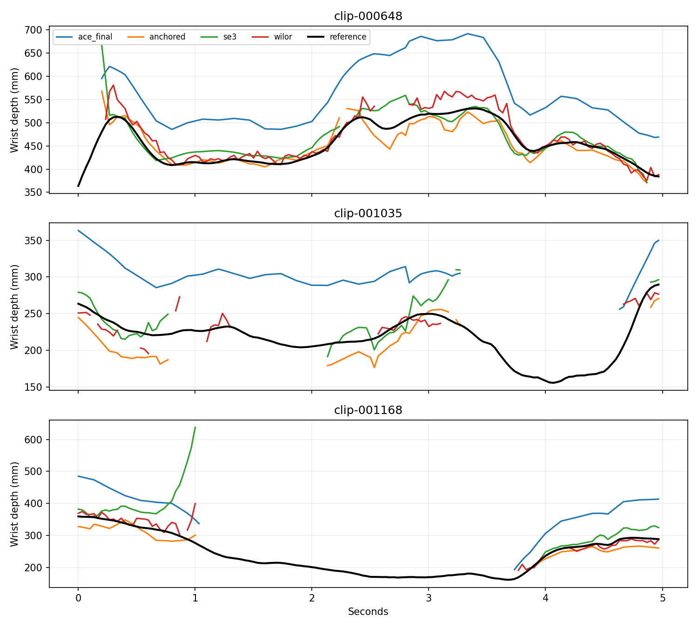

# ACE stereo wrist anchoring and global SE(3) fitting

Both requested variants are implemented and executed. Stereo wrist/palm anchoring
substantially improves ACE's absolute placement. Global SE(3) fitting improves
development accuracy but introduces severe held-out errors. Preserve WiLoR.

## Fixed evaluation population

Development: clips 000175, 000838, 001119; held-out: 000648, 001035, 001168.
Each split has three participant-separated sequences and 450 frames. Every method
is scored on the same anatomical MANO-21 labels in native left optical camera
coordinates, meters. Absolute metrics have no alignment. Missing predictions stay
missing. These public HOT3D training clips may overlap ACE's training recordings;
held-out means local development separation, not confirmed pretrained-model separation.
No new networks were trained or rerun: both methods reuse the audited official
K-given final MANO predictions and independently predicted stereo 2D anchors.

## Held-out results

| Method | Absolute MPJPE mm | Wrist mm | Tips mm | Joint coverage % | Complete-hand coverage % | P90 mm | P95 mm | Depth MAE mm | Capped100 mm |
|---|---:|---:|---:|---:|---:|---:|---:|---:|---:|
| ACE final MANO | 111.08 | 114.01 | 110.32 | 72.00 | 72.00 | 160.95 | 190.91 | 93.24 | 94.68 |
| ACE + stereo wrist/palm anchor | 25.84 | 21.41 | 27.44 | 58.89 | 58.89 | 45.85 | 53.14 | 18.29 | 56.32 |
| ACE + stereo SE(3) | 32.02 | 32.82 | 35.55 | 58.89 | 58.89 | 63.24 | 81.31 | 23.23 | 56.81 |
| WiLoR stereo (preserved) | 22.89 | 21.38 | 30.96 | 58.12 | 28.89 | 40.93 | 55.83 | 17.61 | 53.75 |
| WiLoR + MANO + temporal (preserved) | 24.27 | 29.94 | 26.98 | 67.33 | 67.33 | 35.64 | 47.67 | 18.39 | 45.69 |

Lower error on different observed populations does not establish a paired advantage.
Anchoring's full-hand output retains ACE articulation and fills joints by the model;
it does not directly observe every fingertip. Stereo support masks are exported separately.
No single-view fallback or temporal filling was used for the new variants.

## Paired comparisons

Differences use only identical valid joints and reference frames. Negative favors
the first method. Bootstrap resamples three entire sequences (10,000 draws, seed42);
intervals are exploratory given this small sample.

| Comparison | MPJPE delta mm | Sequence-bootstrap95% interval | Paired fingertip delta mm | Paired wrist delta mm |
|---|---:|---|---:|---:|
| anchored minus ace_final | -90.25 | [-101.83, -63.65] | -88.70 | -95.57 |
| se3 minus ace_final | -84.07 | [-101.68, -59.97] | -80.60 | -84.16 |
| se3 minus anchored | +6.18 | [-5.17, +30.74] | +8.11 | +11.41 |
| anchored minus wilor | +5.02 | [-0.29, +14.06] | +2.58 | -1.19 |
| se3 minus wilor | +8.62 | [-2.25, +38.86] | +7.46 | +9.58 |
| anchored minus wilor_temporal | +8.33 | [+6.45, +12.70] | +7.07 | -0.07 |

The apparent observed-population fingertip advantage over raw WiLoR reverses under
paired comparison. Neither new method establishes a reason to replace WiLoR.
The existing MANO-temporal pipeline also has greater complete-hand coverage.

## Implementation and frozen selection

Anchoring triangulates corresponding wrist and four finger MCP joints (0,5,9,13,17).
Geometry gates reject epipolar error >5px, reprojection error >8px, ray angle <0.5°,
and depth outside0.08–2m. Candidate wrist positions subtract ACE's fixed wrist-relative
palm offsets from the triangulated positions. A weighted geometric median rejects
inconsistent candidates; at least three palm anchors must agree. Weights combine
hand existence scores with inverse z^4, an approximate stereo-depth variance weight,
not calibrated per-joint uncertainty. The selected consensus radius is40mm.

SE(3) starts from that anchored pose and optimizes six global parameters against
both cameras' predicted 2D landmarks. It retains ACE's finger articulation and shape;
all pairwise joint distances are preserved. The objective uses soft-L1 reprojection
(scale4px), a30mm translation prior around the stereo anchor, and a30° rotation
prior. Only geometrically valid stereo landmark pairs contribute. Results must pass
cheirality, depth and ≤60° rotation-delta checks. Failed fits remain missing.

Three configurations were evaluated only on development:25mm consensus/all joints,
25mm consensus/palm-only reprojection,40mm consensus/all joints. Each variant's
configuration minimizes development capped100mm error with missing-joint penalties.
Both selected40mm/all-joints before held-out scoring. Development anchoring achieved
18.00mm and SE(3)13.62mm at51.11% coverage. Configurations were not changed after
seeing held-out failure. A float32/float64 pixel-conversion discrepancy below one
micrometer in output was corrected consistently before final results were saved.

Development coverage is100% on000175,53.33% on000838, and0% on001119. The missing
sequence remains in the denominator and coverage-aware selection score. Observed
development accuracy therefore comes from only two sequences. Bilateral depth-bound
checks were tightened afterward; every saved valid output already satisfies them,
so no prediction or measurement changed.

The frame transform is explicit: archived ACE exports and video calibration use
upright processed optical axes, while the audit's final pose archives use native
optical axes. C maps native→upright (x'=-y,y'=x,z'=z); fitting uses upright coordinates
and benchmark output maps back through C inverse. No ground-truth wrist, articulation,
shape, crop or mask is supplied to fitting. Ground truth is opened for scoring only.

## Failure analysis

SE(3) lowers mean reprojection residual on identical stereo support in every held-out
sequence, approximately5.72→2.90px,14.62→7.26px,14.01→6.98px. However, clip001168's
absolute error worsens from28.63mm after anchoring to59.38mm after SE(3). The optimizer
can explain biased or mutually inconsistent 2D evidence by moving/rotating the rigid
hand away from the true location. This explanation is consistent with the measured
2D/3D discrepancy; no claim of a uniquely identified cause is made. A weak translation
prior permits drift away from the robust stereo estimate. Improving image fit alone
is insufficient evidence of improved metric reconstruction.

The next justified experiment is a stronger stereo-depth trust region or robust
uncertainty model, evaluated on additional sequences. Do not tune that change on the
held-out failure shown here and call the same clips an independent confirmation.
Finger articulation has intentionally not been optimized in these variants.



## Reproduce and infer without GT

`src/handpose/fitting/stereo_rigid.py` contains the GT-free core. The decoder uses the
existing ACE environment (PyTorch/smplx); fitting and evaluation run in the project's
CPU environment. Both modes of the GT-free CLI were exercised on a real150-frame
clip and reproduce benchmark predictions; a synthetic integration test verifies
both modes and explicitly missing stereo observations.

```bash
# Decode official final MANO in the ACE environment. No annotation file is opened.
python scripts/decode_ace_final.py --prediction LEFT.pkl \
  --ace-root third_party/ace --mano-dir checkpoints/mano_converted \
  --output final_left.npz

# Run in the project environment. All inputs must use the same processed optical frame.
python scripts/run_ace_rigid.py --left-predictions LEFT.pkl \
  --right-predictions RIGHT.pkl --final-poses final_left.npz \
  --calibration calibration.json --timestamps timestamps.npz \
  --mode anchored --output outputs/anchored
# Change --mode to se3 for the global rigid fit.

python scripts/benchmark_ace_rigid.py
python scripts/analyze_ace_rigid.py
python -m pytest -q
```

Timestamps NPZ requires synchronized `left`/`right` nanosecond arrays. Final poses NPZ
requires only `joints_3d`, not labels. Predictions include metric positions, validity,
uncalibrated confidence, rotation deltas, stereo evidence, anchor inliers and statuses.
`rotation_delta` is not absolute wrist orientation. All reconstructed joints are
classified model-inferred; supporting observations remain separately identifiable.
Calibration must describe undistorted pinhole views and match each ACE export's
intrinsics. Trusted local pickles only.

[Development selection](frozen_selection.json), [full held-out metrics](held_out_comparison.json),
[paired measurements](paired_comparisons.json), [per-sequence failures](failure_diagnostics.json),
and [artifact hashes](artifact_hashes.json) accompany this report. Raw arrays are
under `outputs/ace-rigid`, excluded from Git. Original baselines remain untouched.
