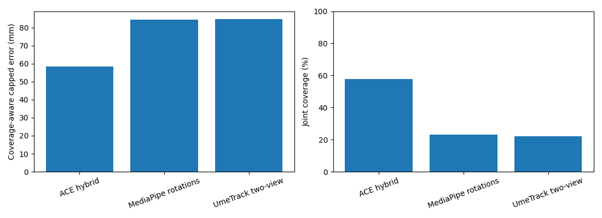
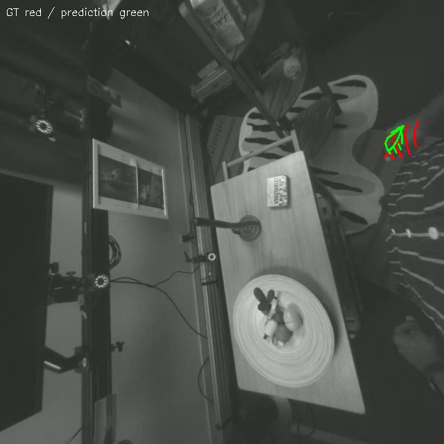
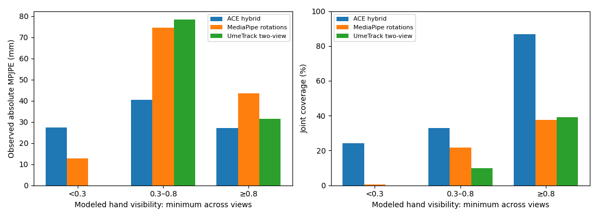
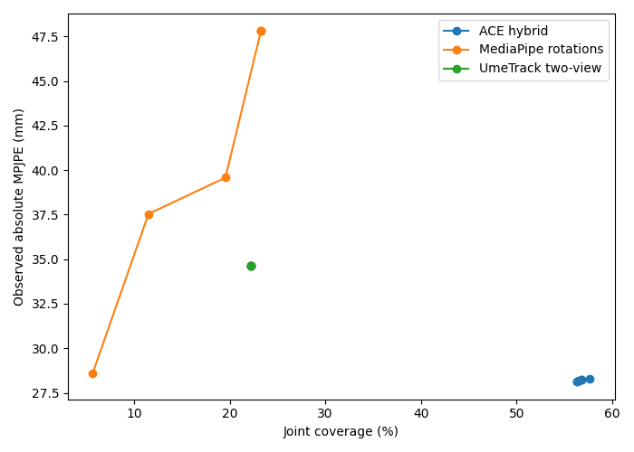

# Stereo hand-pose research report

## Outcome and scope

A working stereo inference project and a frozen three-pipeline HOT3D comparison
were executed on the supplied A100 (40 GB) VM. This is a bounded research round,
not proof of the most accurate possible pipeline. Several requested extensions
remain incomplete, as listed below. No published metric is used as an experimental
result, and no hidden challenge test annotations were accessed.

The lowest common-19 coverage-aware held-out score belongs to **ACE hybrid**.
Among pipelines that output all 21 anatomical joint slots including wrist, the
lowest MANO-21 coverage-aware score belongs to **ACE hybrid**. Differences
must be read with the paired uncertainty intervals and coverage, not just observed
MPJPE. MANO-reference evaluation is distinct from native UmeTrack annotation.

## Frozen held-out results

All three methods use the same 450 frames from three participants: P0010, P0017,
P0021. Parameters were committed in `3ee7b9d` before held-out execution. The
primary score is mean min(error,100 mm), with missing annotated joints assigned
100 mm. Absolute errors use no root, scale, rigid, or Procrustes alignment.

### Native common-19 landmarks

| Model | Abs MPJPE mm | Wrist mm | Tips mm | Joint coverage % | P90 mm | Capped score mm |
|---|---:|---:|---:|---:|---:|---:|
| ACE hybrid | 28.28 | — | 25.97 | 57.65 | 53.10 | 58.28 |
| MediaPipe rotations | 47.80 | — | 38.04 | 23.26 | 88.80 | 84.52 |
| UmeTrack two-view | 34.65 | — | 41.11 | 22.22 | 67.20 | 84.86 |

### Separate MANO-21 anatomical reference

| Model | Abs MPJPE mm | Wrist mm | Tips mm | Joint coverage % | P90 mm | Capped score mm |
|---|---:|---:|---:|---:|---:|---:|
| ACE hybrid | 27.18 | 30.90 | 25.82 | 58.01 | 52.09 | 57.41 |
| MediaPipe rotations | 46.26 | 36.61 | 38.38 | 23.20 | 86.62 | 84.42 |
| UmeTrack two-view | 34.83 | — | 40.98 | 20.11 | 67.40 | 86.34 |



UmeTrack cannot provide an interchangeable anatomical wrist or thumb CMC; those
slots remain missing and are penalized in MANO-21 coverage-aware evaluation.
Eligible annotations can lie outside either image; these difficult frames are
retained. Visibility-stratified results, where available, are separate diagnostics.
No model is allowed to improve its observed error by silently deleting evaluated
frames. Joint coverage is not the same as full-frame tracking coverage; both are
available in the comparison JSON files.

### Paired uncertainty

- ACE hybrid minus MediaPipe rotations: -26.23 mm; paired sequence-bootstrap 95% CI [-40.04, -16.49].
- ACE hybrid minus UmeTrack two-view: -26.58 mm; paired sequence-bootstrap 95% CI [-35.23, -14.58].
- MediaPipe rotations minus UmeTrack two-view: -0.34 mm; paired sequence-bootstrap 95% CI [-7.76, 4.82].

Negative differences favor the first model. Intervals resample sequences, not
individual correlated joints. Only three independent clusters are available, so
these intervals are coarse and cannot support broad state-of-the-art claims.
An interval containing zero indicates statistical indistinguishability under
this procedure. Pretrained contamination remains a separate limitation.

## Development selection and ablations

Development participants P0003, P0013 and P0018 are disjoint from held-out and
smoke participant P0002. No hyperparameter was tuned using held-out errors.

| Model | Abs MPJPE mm | Wrist mm | Tips mm | Joint coverage % | P90 mm | Capped score mm |
|---|---:|---:|---:|---:|---:|---:|
| ACE hybrid | 25.97 | — | 31.17 | 50.42 | 41.53 | 61.44 |
| MediaPipe rotations | 120.18 | — | 103.00 | 55.13 | 610.73 | 63.82 |
| UmeTrack two-view | 86.65 | — | 89.94 | 49.33 | 70.75 | 65.29 |
| POEM two-view | 163.70 | — | 160.62 | 60.89 | 654.12 | 68.58 |

MediaPipe, independent RTMDet/RTMPose, confidence fusion, predicted-MediaPipe-crop
RTMPose, ACE monocular/stereo, POEM large two-view and UmeTrack predicted-crop
inference were executed. Some simpler baseline comparisons cover fewer development
sequences; consult the experiment log and individual artifacts for exact scopes.
They are not silently pooled into the frozen450-frame comparison.

On the two development sequences with ACE observations, robust stereo plus a
sequence-consistent bone-length term and 0.1 s local-linear temporal refinement
changed 21.307→20.169mm and 36.869→35.411mm. The third sequence remained missing.
The strongest tested independent multiview prior was UmeTrack under the available
predicted-crop protocol; adding its gated prior did not beat the stronger anatomy
setting. No pose alignment was applied to make priors agree.

MANO fitting of RTMPose observations increased coverage but worsened observed
error 15.000→22.360mm on the first development sequence. FoundationStereo large
with correct horizontal rectification changed 27.103→26.634mm under conservative
surface-depth fusion at unchanged coverage; depth-only samples were worse at
34.298mm. Neither component was included in the frozen pipelines. These are
single-sequence ablations, not conclusive universal comparisons.

## Architecture and failure analysis

The ACE hybrid runs released calibrated monocular inference on each view,
converts normalized landmarks to original pixels, and performs confidence-weighted
metric triangulation with epipolar, ray-angle, reprojection and cheirality checks.
Robust optimization balances reprojection, stereo position, and per-sequence
median bone lengths. Offline local-linear smoothing uses a 0.1 s window and fills
only bracketed gaps of at most0.1 s. No ground-truth crops, masks, poses, or shapes
enter this pipeline. The default lightweight CLI remains MediaPipe; ACE is
explicitly selected with `--model ace`.

Native HOT3D Quest images require a clockwise rotation for ACE. Camera and pixel
transforms are inverted before output, retaining original-left-camera metric
coordinates (+x right,+y down,+z forward). A regression against the benchmark
adapter agreed to within0.000602 mm with identical validity masks.

Wrong-hand identity can dominate error: an inspected development overlay shows
MediaPipe selecting the visible left hand while the right hand is mostly outside
the image. UmeTrack and POEM cannot reliably repair the incorrect initialization.
Unfiltered ACE triangulation increases coverage but produces large depth outliers
under partial visibility; geometric filtering trades coverage for reliability.
Small stereo disparity makes depth sensitive to landmark errors. Model surfaces
and anatomical joint centers also differ, explaining why raw dense surface depth
is not automatically a better joint constraint. Learned priors can look plausible
while misplacing the entire hand; ACE's105.048mm monocular smoke error alongside
7.775mm PA error demonstrates this distinction.



The example above has 89.71 mm observed common-19 error. Ground truth is red and
prediction green. The hand is near the image boundary with incomplete evidence.
Further worst-error, fast-motion and low-visibility overlays are in figures/failures.

## Data, checkpoints and reproducibility

HOT3D public training clips are obtained from the official BOP distribution.
Official FISHEYE624 projection and UmeTrack skinning are used. SHOW3D public hand-v3
scenes were downloaded at revision 070d5586edf369dfa17a374b4e9f80d5611577d5;
provided 2D annotations were checked against projected 3D points. Its baseline
results are separate from HOT3D; a full three-model SHOW3D comparison remains undone.
Both of these evaluated stereo streams are monochrome.

EgoStandard's authorized bucket sample contains 547 synchronized RGB stereo frames
at 1920×1456,30 Hz. Video, intrinsics/extrinsics, timestamps, native hand transforms,
bad-frame labels and operator IDs were decoded. MediaPipe inference produced all
547 output rows;20.632% of joint slots had valid stereo estimates. This is not a
GT coverage or accuracy measurement. The pose joint mapping is undocumented in
the embedded schemas, linked technical documentation denied access, and the
translation scale is explicitly marked unverified. No anatomical accuracy score
is claimed for EgoStandard. Source bytes are hashed because the bucket is mutable.

The supplied MANO archive is stored outside Git. Source revisions are recorded in
`configs/sources.lock.json`; executed package snapshots and checkpoint hashes are
in `configs/environments` and `configs/checkpoints.lock.json`. ACE's released
checkpoint and backbone revisions are fixed in its downloader. Some environments
use Python 3.12/PyTorch 2.11 rather than original upstream versions; executed
compatibility fixes are retained. FoundationStereo's torch-hub DINO dependency
was fetched from a moving reference, so that pilot still has a reproducibility
gap. Research-model environment setup is partly manual; the clean baseline
installation and weight-free tests are supported.

ACE lists HOT3D in its training data. This local participant split does not rule
out pretrained benchmark contamination. Other pretrained dataset overlaps have
not been exhaustively audited. Annotation/model joint-definition differences and
potential GT error limit millimeter-level claims.

## Runtime, official reproduction and limitations

Runtime measurements are in each run's metadata or `runtime.json`. ACE totals
include model loading for both views; detector timings generally exclude decoding
and initialization. Jobs overlapped during research, so these are not a controlled
speed comparison and are not placed in a misleading single leaderboard column.
A standardized isolated runtime and peak-memory comparison remains incomplete.

A fresh 30-frame ACE hybrid run completed in 175.9 seconds, including both model loads, refinement and output encoding. The sampled device-wide GPU-memory peak was 14,606 MiB. This is a cold-start integration profile, not steady-state throughput or an exact allocator peak.

UmeTrack's official known-skeleton example was also executed on 30 frames. It has
four available cameras and selects two crops, using GT crop guidance and the GT
subject skeleton. Its native-unit error 9.662 is a reproduction diagnostic only,
excluded from our two-camera predicted-crop leaderboard.

UA-Fit's inspected checkpoint instructions say its uncertainty checkpoint is
forthcoming; its analytical solver was not reproduced. POEM's adapted inference
executed, but an independent official-demo reproduction remains incomplete.
Additional candidates and learned temporal priors are documented in
[additional_candidates.md](additional_candidates.md); none has a claimed score.
No new model was trained or paid infrastructure provisioned.

The remaining work includes authoritative EgoStandard conventions, broader
manipulation activities and participants, exhaustive pretrained-overlap checks,
more independent temporal/occlusion evaluation, robust hand identity, released
UA-Fit weights, further candidates, fully automated heavy-model installs, and
controlled runtime/VRAM measurements. The aspirational accuracy and coverage
targets must be assessed from the table above; they are not assumed achieved.

## Inference and artifacts

```bash
python scripts/run_inference.py --model ace \
  --left data/example/left.mp4 --right data/example/right.mp4 \
  --calibration data/example/calibration.json \
  --timestamps data/example/timestamps.npz --rotate-cw \
  --anatomy-weight 1 --temporal-seconds 0.1 --output outputs/example-ace
```

Use `--rotate-cw` only for the corresponding native orientation. Nonzero-distortion
input must be undistorted first for ACE. Ground truth is not needed. Required
NPY/NPZ, timestamps, confidence, validity, wrist-pose, metadata and overlay-video
outputs are generated. Unavailable wrist orientation is NaN, never fabricated.
Provenance distinguishes stereo observations, multiview model inference, anatomical
fitting, and temporal reconstruction; original observation masks are preserved.





Modeled hand visibility is an annotation-derived proxy, not a dedicated per-joint
occlusion label. Blank bars mean no observed eligible joints, not zero error.

Measured JSON comparisons and per-sequence metrics accompany this report.
[experiment_metrics.json](experiment_metrics.json) preserves the completed pilot
measurements and marks invalid configurations explicitly. Dataset split manifests
and hashes are tracked in configs/datasets. Pilot
plots and worst-frame indices are under `reports/figures`; the full experimental
record is in PROGRESS.md and the ignored outputs directory. Large assets remain
outside Git.
