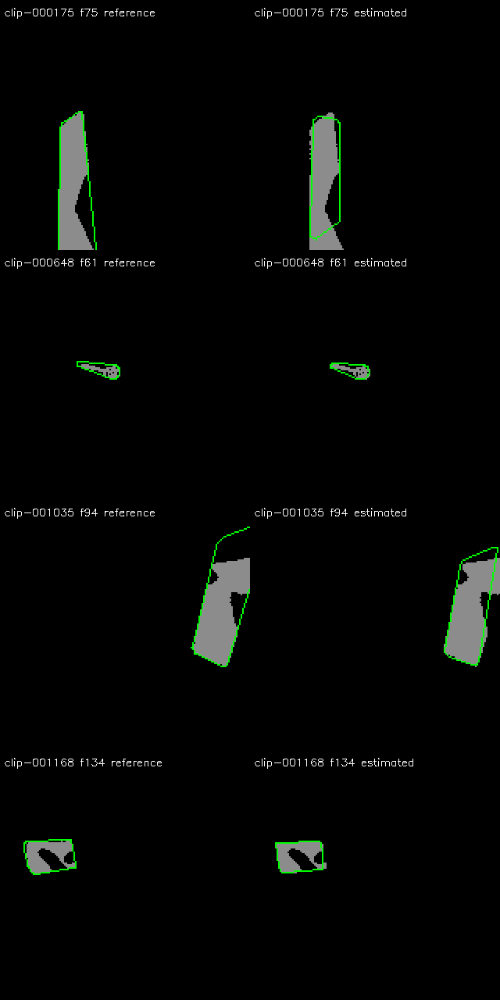
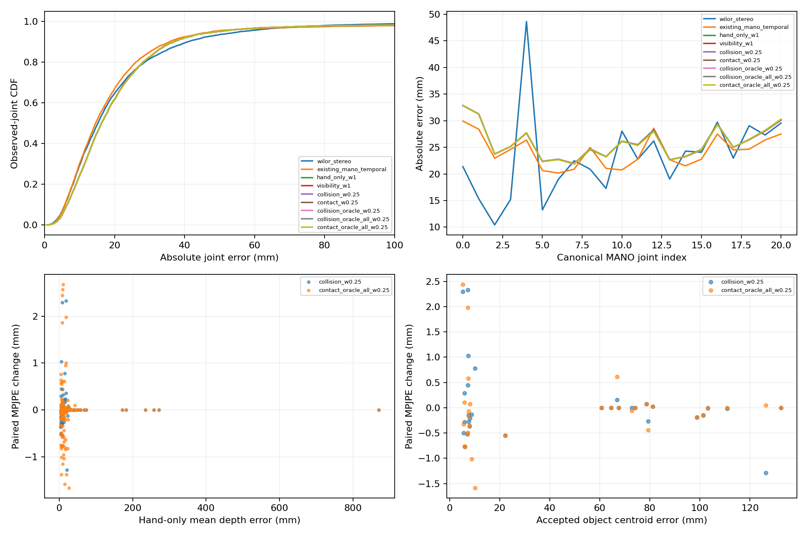
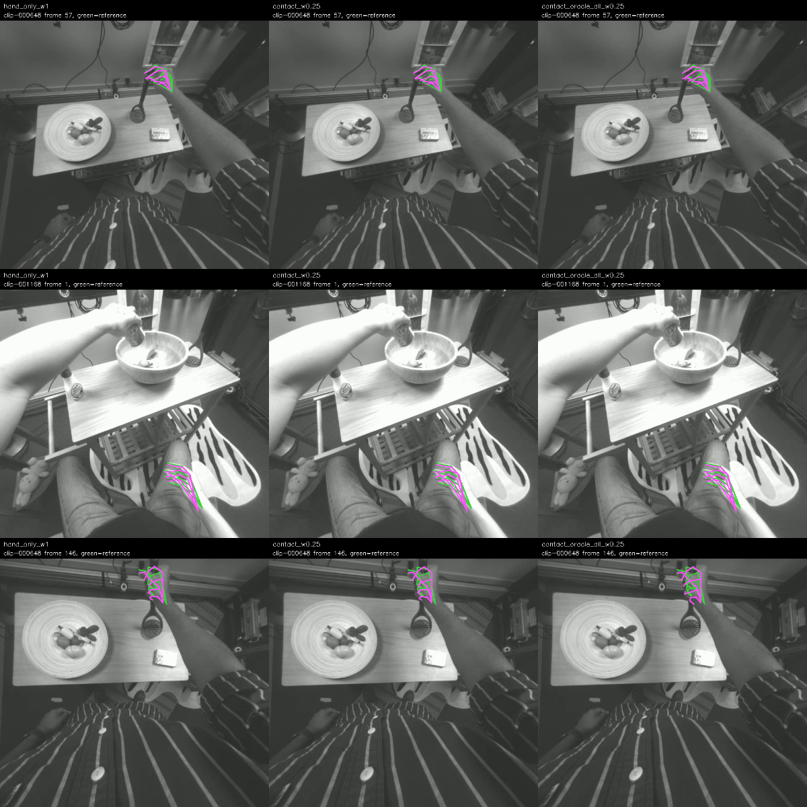

# Object-aware stereo hand reconstruction: measured experiment

**Recommendation: retain the existing WiLoR pipelines.** This implementation did not
demonstrate a practically meaningful object-aware improvement. Estimated-object
contact changed the controlled refit by +0.0009 mm;
even reference-pose contact on all selected objects changed it by
-0.0206 mm. These results do not justify
replacing raw WiLoR stereo or the existing MANO + temporal pipeline.

All hand errors below are **absolute native-left-camera MANO21 errors in millimeters**,
without alignment. Evaluation covers the same 450 frames from three separate
participants as the previous baseline; development used another 450 frames from
three participants. This is a controlled regression cohort, not a newly collected
held-out confirmation set. Each clip contains 150 consecutive frames (five seconds).

| Pipeline | Abs MPJPE | Wrist | Fingertips | Coverage | P90 | P95 | Depth MAE | >100 mm joints |
|---|---:|---:|---:|---:|---:|---:|---:|---:|
| WiLoR stereo (preserved) | 22.892 | 21.384 | 30.962 | 58.12% | 40.931 | 55.835 | 17.611 | 1.09% |
| Existing MANO + 50 ms temporal | 24.267 | 29.940 | 26.983 | 67.33% | 35.636 | 47.669 | 18.386 | 2.01% |
| A: controlled MANO refit | 25.950 | 32.842 | 28.019 | 67.69% | 36.873 | 49.279 | 18.784 | 1.72% |
| B: mask visibility | 25.950 | 32.839 | 28.014 | 67.69% | 36.893 | 49.279 | 18.795 | 1.72% |
| C: estimated object + collision | 25.956 | 32.839 | 28.026 | 67.69% | 36.887 | 49.201 | 18.793 | 1.72% |
| E: estimated object + contact | 25.950 | 32.835 | 28.007 | 67.69% | 36.887 | 49.201 | 18.790 | 1.72% |
| D: reference pose, same acceptance | 25.946 | 32.835 | 27.998 | 67.69% | 36.881 | 49.279 | 18.776 | 1.72% |
| Oracle: collision, all selected | 25.960 | 32.832 | 28.028 | 67.69% | 36.893 | 49.279 | 18.768 | 1.72% |
| Oracle: contact, all selected | 25.929 | 32.807 | 27.990 | 67.69% | 36.824 | 49.007 | 18.731 | 1.72% |

A is a new controlled SMPL-X MANO refit used to isolate the added losses. It is not an
exact rerun of the historical parafit Adam + 50 ms temporal implementation; that
pipeline and the raw 22.8916 mm baseline are both preserved and shown separately.
B/C/E/D share A's hand eligibility and initialization. Extra fitted joints are inferred,
not newly stereo-observed. Observed-joint errors and coverage must be read together.

## Paired changes from the controlled hand-only refit

Negative changes improve accuracy. Intervals bootstrap entire sequences, not individual
frames. Only three evaluation sequences are available, so intervals do not establish
broad generalization. The point estimate weights shared joints; intervals use per-frame
mean deltas clustered by sequence (weighting differs if partial frames are present).

| Pipeline | Paired MPJPE change (mm) | Sequence bootstrap 95% interval (mm) |
|---|---:|---:|
| Existing MANO + 50 ms temporal | -1.268 | -2.756 to +0.912 |
| A: controlled MANO refit | +0.000 | +0.000 to +0.000 |
| B: mask visibility | +0.001 | -0.011 to +0.008 |
| C: estimated object + collision | +0.006 | -0.022 to +0.043 |
| E: estimated object + contact | +0.001 | -0.042 to +0.043 |
| D: reference pose, same acceptance | -0.004 | -0.074 to +0.041 |
| Oracle: collision, all selected | +0.010 | -0.089 to +0.082 |
| Oracle: contact, all selected | -0.021 | -0.114 to +0.013 |

The complete [paired comparisons](held_out_hand_results.json) include comparisons
against raw WiLoR, visibility-only and the refit control. Each result also contains
capped-100 mm error with missing predictions penalized, per-joint error, depth bins,
catastrophic-frame frequency, and exact observed-joint counts.

## Object pose quality before hand refinement

| Population | Frames | Origin translation mm | Centroid translation mm | Symmetry-reduced angle deg | ADD-S mm |
|---|---:|---:|---:|---:|---:|
| all_attempted | 156 | 58.35 | 38.94 | 88.85 | 28.59 |
| accepted | 31 | 85.90 | 46.74 | 138.89 | 39.59 |

Selected objects are chosen using predicted right-hand proximity in both supplied
masks. Rejected or absent object estimates do not remove hand frames from evaluation.
The conservative pose gate accepts only 31 of 450
frames. Its hypothesis spread is not a calibrated probability and did not reliably
select the most accurate estimates. Origin translation is sensitive to rotation for
objects with off-center origins; centroid translation is reported independently.
ADD-S uses nearest sampled surface points and is a diagnostic, not a substitute for
symmetry-aware pose accuracy. Continuous rotational symmetries use 3° sampling.

Visible masks do not reveal the complete silhouette. The convex-silhouette estimator
can explain a cropped or occluded observation with incorrect object depth/orientation.
The reference projection check confirms metric camera/mesh placement but also makes
this incomplete-observation failure visible. Geometric ambiguity remains even when
image fit residuals are small.

## Occluded fingertips

This uses reference mesh ray intersections for the **selected object's occlusion in
the left camera**, evaluated only after inference. It does not label all hand/object
occlusion. No reference hand poses enter fitting. The denominators below expose
missing predictions in this small difficult subset.

| Pipeline | Occluded fingertip error (mm) | Observed / reference-eligible fingertips |
|---|---:|---:|
| WiLoR stereo (preserved) | 22.664 | 73/88 |
| Existing MANO + 50 ms temporal | 19.754 | 88/88 |
| A: controlled MANO refit | 20.583 | 88/88 |
| B: mask visibility | 20.572 | 88/88 |
| C: estimated object + collision | 20.306 | 88/88 |
| E: estimated object + contact | 20.216 | 88/88 |
| D: reference pose, same acceptance | 19.851 | 88/88 |
| Oracle: collision, all selected | 19.435 | 88/88 |
| Oracle: contact, all selected | 19.758 | 88/88 |

Contact-point error is unavailable: this experiment has no verified ground-truth
contact annotations. Heuristic contact weights must not be described as correct
contact labels. Collision uses a filled 3 mm voxel representation of the original mesh,
with a 2 mm soft penetration allowance, so tiny physical distances are approximate.

## Selection, correlations, and interpretation

The shared collision/contact weight is **0.25**, chosen from development
weights 0.25 and 1 using mean capped error with missing-joint penalties. Shared weight
keeps the contact-vs-collision ablation controlled. The frozen configuration was saved
before any held-out hand fitting. Other settings were fixed for this experiment.

[Paired analysis](paired_analysis.json) reports per-clip changes, improved/worsened
joints, and descriptive Spearman correlations between estimated object-centroid error
and changes in hand error. Correlations on the small accepted-frame subset are
exploratory; temporally adjacent frames are not independent evidence.

A known object excludes physically impossible hand locations but generally does not
uniquely localize the hand. Nonpenetration supplies no attraction when an erroneous
hand remains outside the object. The conservative contact gate also cannot repair a
large depth outlier when the initial fingertip is far from the surface. Wrong object
pose can introduce a new common translation bias across many joints. Perfect object
pose alone does not supply finger contact identity or resolve invisible articulation.

The oracle measures these particular constraints with reference object localization.
It is **not the maximum possible improvement** achievable with accurate object pose.
The all-selected oracle also increases constraint availability, so compare it separately
from the same-acceptance oracle. This is ContactOpt-inspired geometric optimization,
not execution of ContactOpt's learned contact prediction model.

Overlay examples are deliberately selected from the best, median and worst paired
oracle changes, not random representative samples. Magenta is the reconstruction and
green the reference. The [runtime record](runtime.json) reports hand fitting and object pose separately; pose estimation
and mesh-field preparation are separate costs from the recorded hand fitting time.

## Reproduction and remaining work

See [protocol and commands](README.md), [frozen selection](frozen_selection.json),
[development results](development_hand_results.json), [mesh/data provenance](provenance.json),
and [artifact hashes](artifact_hashes.json). Model predictions, surfaces, masks and poses
remain outside Git; aggregate measurements, code, configurations and figures are committed.

No new model survey, training, dense stereo model or paid provisioning was performed.
The next stronger test requires object pose from evidence robust to occlusion and image
cropping, calibrated uncertainty, better contact evidence, and fresh participant-separated
clips. Further work should first show paired improvement on development clips before
any replacement of the preserved WiLoR pipeline. Nothing here demonstrates sub-10 mm
absolute accuracy or >95% coverage.
